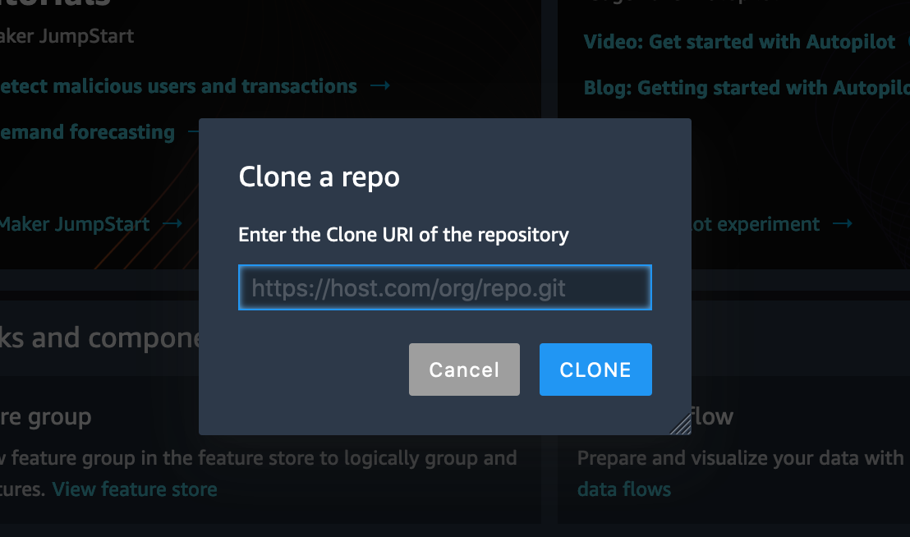

# Predict Bike Sharing Demand with AutoGluon

<details open>
<summary> <b>Overview<b></summary>

In this project, we will apply the knowledge and methods learned in Machine Learning course to compete in a Kaggle competition using the AutoGluon library.

With a Kaggle account the next step was to download the Bike Sharing Demand dataset, and train a model using AutoGluon.  Finally we submit the results for a ranking.

After they complete the first workflow, we will be iterating on the process by trying to improve the score. For this process, we will add some featuresto the dataset and tune some of the hyperparameters available with AutoGluon.

Finally they a submitted writtend report of the findings details which methods provided the best score improvement and why.  Please refer to the report [here](project-report.md).

There are also images of the training and eval in the notebook, also submissions that achive that.
</details>

<details closed>
<summary> <b>Getting Started<b></summary>

* Clone this template repository `git clone git@github.com:udacity/nd009t-c1-intro-to-ml-project-starter.git` into AWS Sagemaker Studio (or local development).




* Proceed with the project within the [jupyter notebook](project-template.ipynb).
* Visit the [Kaggle Bike Sharing Demand Competition](https://www.kaggle.com/c/bike-sharing-demand) page. There you will see the overall details about the competition including overview, data, code, discussion, leaderboard, and rules. You will primarily be focused on the data and ranking sections.

### Dependencies

```
Python 3.7
MXNet 1.8
Pandas >= 1.2.4
AutoGluon 0.2.0 
```

### Installation
For this project, it is highly recommended to use Sagemaker Studio from the course provided AWS workspace. This will simplify much of the installation needed to get started.

For local development, you will need to setup a jupyter lab instance.
* Follow the [jupyter install](https://jupyter.org/install.html) link for best practices to install and start a jupyter lab instance.
* If you have a python virtual environment already installed you can just `pip` install it.
```
pip install jupyterlab
```
* There are also docker containers containing jupyter lab from [Jupyter Docker Stacks](https://jupyter-docker-stacks.readthedocs.io/en/latest/index.html).

</details>

<details open>
<summary> <b>Results<b></summary>

No results more than the explanation in the youtube video.


</details>

<details open>
<summary> <b>Video Explanation<b></summary>

Bike Prediction using AutoGluon

[](https://youtu.be/9GqpWxXe-e4)


</details>

<details open>
<summary> <b>Contributing<b></summary>

Your contributions are always welcome! Please feel free to fork and modify the content but remember to finally do a pull request.

</details>

<details open>
<summary> :iphone: <b>Having Problems?<b></summary>

<p align = "center">

[](https://www.linkedin.com/in/riawa)
[](https://t.me/issaiass)
[](https://www.instagram.com/daqsyspty/)
[](https://twitter.com/daqsyspty) 
[](https://www.facebook.com/daqsyspty)
[](https://www.linkedin.com/in/riawe)
[](https://www.linkedin.com/in/riawe)
[](https://wa.me/50766168542?text=Hello%20Rangel)
[](mailto:issaiass@hotmail.com)
[](mailto:riawalles@gmail.com)

</p

</details>

<details open>
<summary> <b>License<b></summary>
<p align = "center">

</p>
</details>