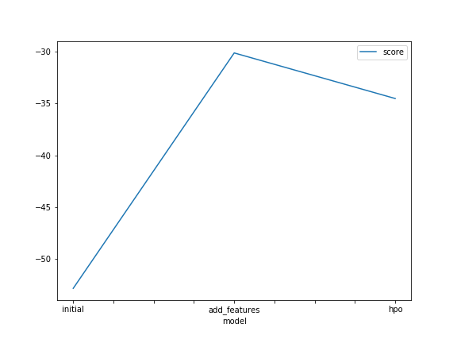
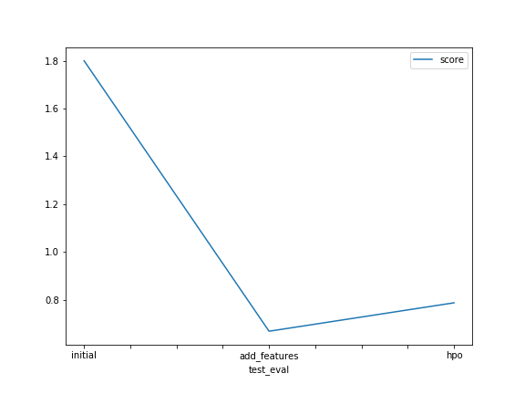

# Report: Predict Bike Sharing Demand with AutoGluon Solution
#### Rangel Alvarado

## Initial Training
### What did you realize when you tried to submit your predictions? What changes were needed to the output of the predictor to submit your results?
We started to train the bike sharing dataset. First, we tried to submit after the autogluon predictor solved for regression and using the RMSE evaluation metric ignoring the <em>casual</em> and <em>registered</em> columns. 

When generated the output, currently we didn't find any issue submitting because we validated that the predictions are all positive.

### What was the top ranked model that performed?
Our top ranking model was the <em>WeightedEnsemble_L3</em> with a <em>score</em> of -52.850111.  This is not as a good metric but was a good start and tells us what we could do to improve the model.  Usually ensemble methods perform good because are a combination of different methods of machine learning together, so makes sense that ensembles are always prefered to single models. 

## Exploratory data analysis and feature creation
### What did the exploratory analysis find and how did you add additional features?
We just tested one feature for explode in several features, as seen in the dataset <em>datetime</em> was the column prefered to decompose in several data fields like <em>year</em>, <em>month</em>, <em>day</em> and <em>hour</em>.

Decomposed, we just added it to the new column field.

### How much better did your model preform after adding additional features and why do you think that is?
The model improve slightly better, we need to explore more regarding of tunning some hyperparamenters.  We saw that even adding those features doesnt' improve so much the training and the testing so we need to do a further analysis for improving the model or by adding more hyperparameters.

## Hyper parameter tuning
### How much better did your model preform after trying different hyper parameters?
The hyperparameter optimizator was outstanding.  It improves considerably the performance of the model in the test set.  From a value of 1.7 aprox to 0.78, off course it was not our best model but it helps due to the first shot made but with more experience and tests will be at result in a huge impact on the test set.  One thing to note is that is very difficult to achive good performance of the model and we must build expertise with practice to improve the training pipeline.

### If you were given more time with this dataset, where do you think you would spend more time?
I think we could spend more time on two phases, if the data is clean, we could spend more time on creating more hyperparameters like the recommendations of the outstanding part recommends, separating different hours of the day as different tags to help the model achive the results faster.

Another point is to improve the pipeline and the hyperparameter part.  Taking annotation of each tunning method and parameter we can check the improvement of the model and how to tweak those parameters.

### Create a table with the models you ran, the hyperparameters modified, and the kaggle score.
|model|hpo1|hpo2|hpo3|score|
|--|--|--|--|--|
|initial|time_limit=60|presets=best_quality|nn_options.num_epochs=15|1.79881|
|add_features|time_limit=60|presets=best_quality|gbm_options.num_boos_round=50|0.6689|
|hpo|time_limit=60|presets=best_quality|knn_options.weights=distance|0.78724|

### Create a line plot showing the top model score for the three (or more) training runs during the project.

Model in term of features vs score - Results

### Create a line plot showing the top kaggle score for the three (or more) prediction submissions during the project.

Test Evaluation Graph vs. Score - Results

## Summary
- We tested Autogluon at first for training a plain model, no much optimization
- Next we added some features separating the datetime column to year, month, day, hour
- Tested again the model it outperforms the previous one with a kaggle score near 0.66.
- Finally we dida hyperparameter tunning to try discover more in depth if we could deliver a better performance.  It was not as good as the previous one but with a good training hyperparameter values probably we could achive better results.
- Finally we plot and make a draft dataframe of the results to compare.  This is a common and good practice when you are tunning the models.  Always try to get a log of the hyperparameters to tune and make a small batch of tests.